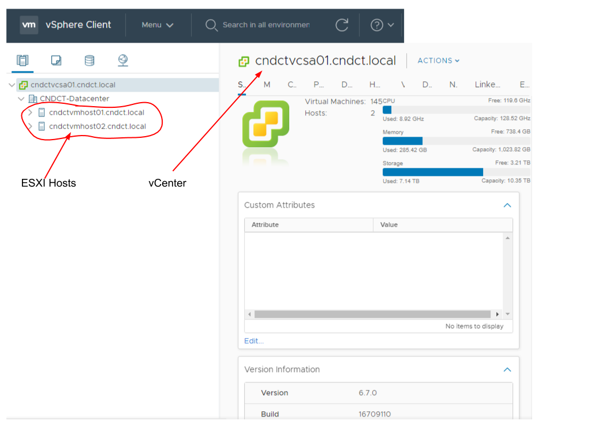

# Infrastructure Overview
#### By: Tim Bogues
The environment used for the Connecticut National Guard’s cyber range is [VMware vSphere](https://docs.vmware.com/en/VMware-vSphere/index.html). There are two major components that make up a VMware vSphere environment: vCenter management interface and ESXI host servers. The vCenter is a Linux based VM (virtual machine) that runs in a layer on top of the host operating system of a given ESXI host. The purpose of this VM is to allow for centralized management (both with and without manual user intervention) of a VMware vSphere environment. More advanced editions of vCenter (like the one used by the CT National Guard) include built in automation tools that are very useful in automating the deployment of VMs and applications. More information of our deployment process can be found here: [https://christophergeiger3.github.io/UConn-x-National-Guard-Documentation/vm_deployment_process/](https://christophergeiger3.github.io/UConn-x-National-Guard-Documentation/vm_deployment_process/).

The ESXI hosts are physical servers that run a customized Linux distribution developed by VMware. The purpose of these servers is to host all of the VMs created in VMware vSphere. The customized Linux operating system that these hosts run allow for direct kernel access from a VM’s guest operating system (the operating system running on a VM) to the physical components available on the physical host servers. These components include, but are not limited to, RAM (random access memory), CPU (central processing unit), GPU (graphics processing unit), and disk storage.

In this environment, the vCenter is running on version 6.7.0, and the ESXI host servers are running on version 6.5.0. Version mismatch is fully supported by VMware, so long as vCenter is at least on the same version or higher as the ESXI host servers. The physical server infrastructure includes two Dell PowerEdge M630 servers that serve as the ESXI hosts. They both have 512 GB of RAM, two 14 core processors, and a total of 10.35 TB of storage made available between the two hosts. These are important specifications to keep in mind when creating virtual machines. Each virtual machine will use a portion of these resources, so it is important to ensure there are enough processor and memory resources available to meet the requirements of each provisioned virtual machine. Here is a screenshot of the VMware vCenter interface:

