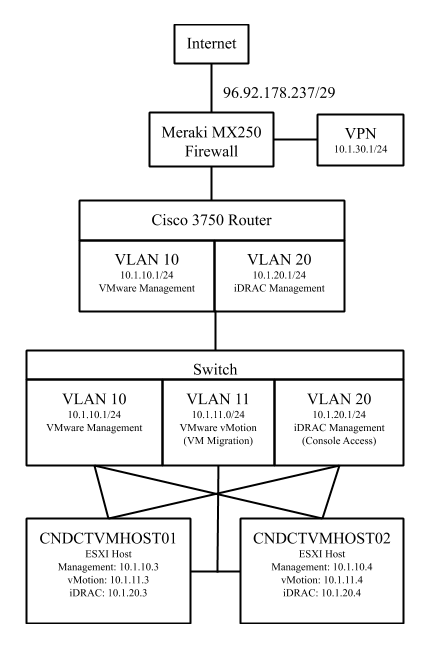
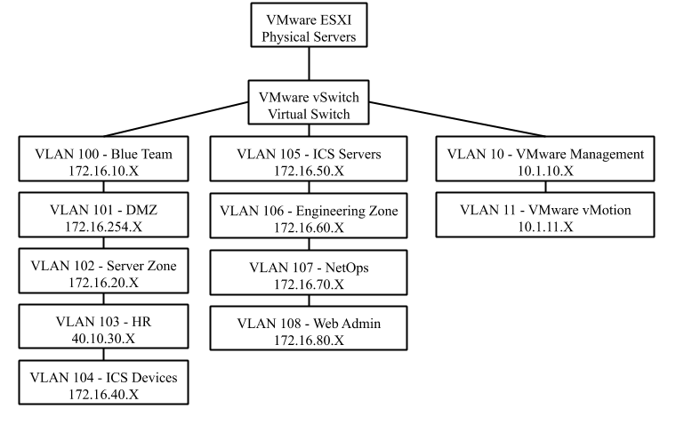

# Network Overview
#### By: Tim Bogues
The cyber range contains several VLANs (virtual local area network) for the VMs hosted in vSphere to connect to. Each VLAN contains a set of Internet Protocol (IP) addresses in a common address space. The subnets available to the cyber range are primarily private 172.16.X.X and 10.1.X.X IP address spaces but also include some public IP addresses for external web services and routing. Here are some diagrams that better illustrate the VLANs available and their recommended usage:

This first diagram illustrates the physical network infrastructure. The diagram shows the different levels of the physical network connected equipment. The ESXI hosts are connected to the switches, which are connected to a router, which is connected to a firewall, and finally reaches the internet. Though, because of the firewall, only allowed sources on the network are allowed to reach the public internet. An example of this would be a web server VM that is running on one of the ESXI hosts. Each ESXI host server has three physical network connections. The connections are as follows: VMware management, iDRAC management, and VMware vMotion. VMware management is the primary IP address for the operating system running on the ESXI servers. This IP is what is used to connect to the Linux operating system over SSH (secure shell) as well as provide the vCenter services management access/control over the ESXI servers. VMware vMotion is the mechanism used for migrating VMs between the two hosts. One of the benefits of server virtualization is in the event of an outage on one of the servers, the other server can detect this outage, transfer the virtual servers over to the running physical server(s), and then bring the VMs back online and available. This vMotion interface provides a dedicated connection for this VM transfer traffic to run over for best performance/capability and is a best practice recommended by VMware. The [iDRAC interface](https://www.delltechnologies.com/en-us/solutions/openmanage/idrac.htm) is a connection provided by Dell in order to provide visual console access to the physical servers as if you had a monitor plugged into them right in front of you. This is useful in the event VMware vSphere services become unavailable and action needs to be taken on the physical servers, without having to physically go to the data center where the servers are located.

This second diagram illustrates the virtual network infrastructure. This virtual network infrastructure sits inside of the physical ESXI hosts, and it uses the physical connections attached to the ESXI hosts for connectivity outside of the VMware environment. There are several VLANs available within vSphere for VMs to connect to. All of the 172.X.X.X IP addresses are only internally routable and are not permitted to reach the internet. For example, we used "VLAN 102 - Server Zone" for internal traffic between Active Directory and Apache for scenario 1. More information on scenario 1 can be found here: [https://uconn-ctng.github.io/UConn-x-National-Guard-Documentation/scenario1/](https://uconn-ctng.github.io/UConn-x-National-Guard-Documentation/scenario1/). We also used "VLAN 10 - VMware Management" in scenario 1. This VLAN is permitted to reach the internet and can be accessed from the Cisco Meraki VPN, so we used this VLAN for user access to the web server. There are several other 172.X.X.X VLANS as well as a 40.10.30.X VLAN, which is a public IP range and routable on the internet, that we have not used yet as part of our scenarios. All network traffic flows to and from the VMs over the VLANs that they are connected to, which are also trunked into the physical interfaces on the ESXI hosts.
